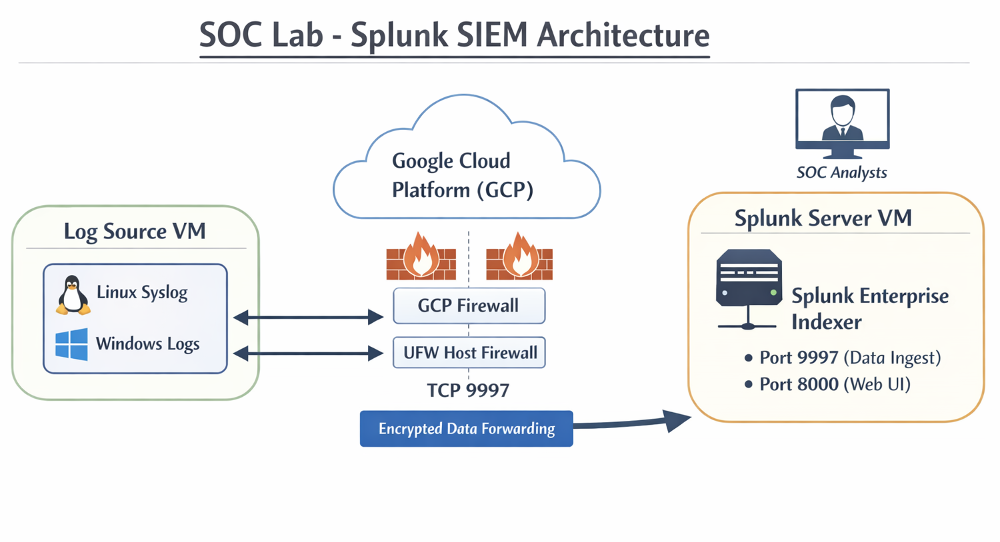
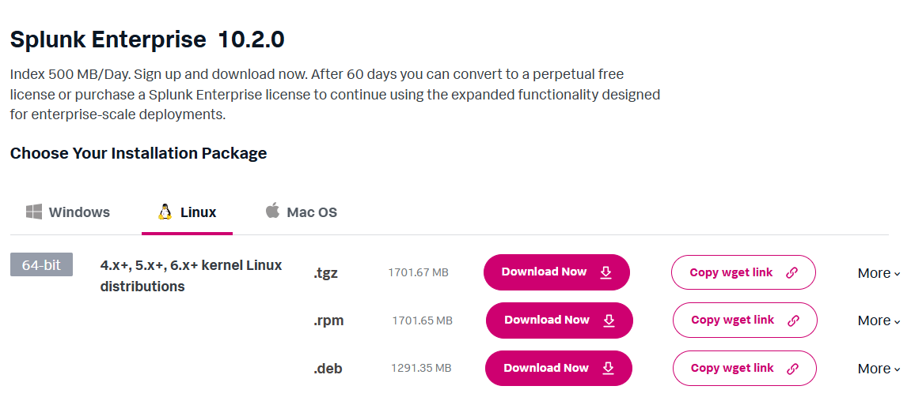
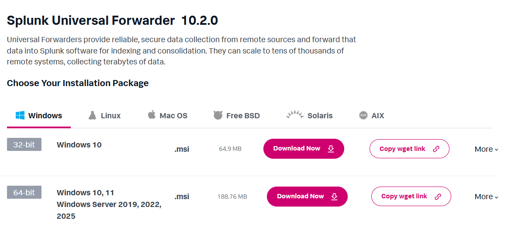
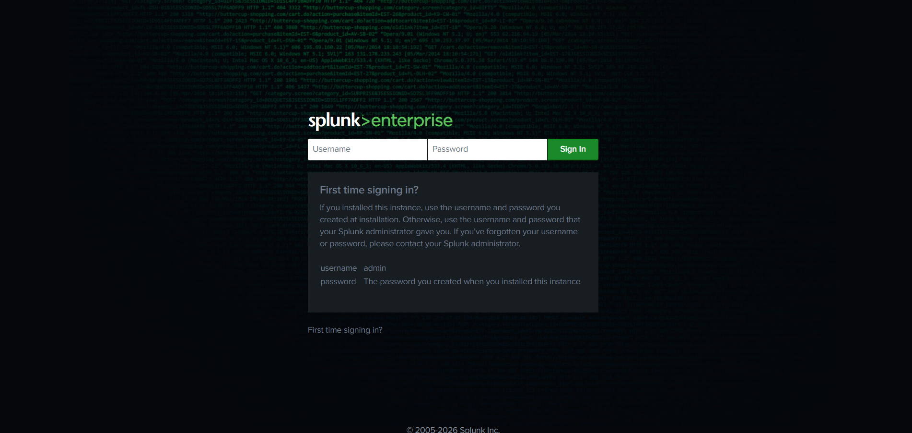
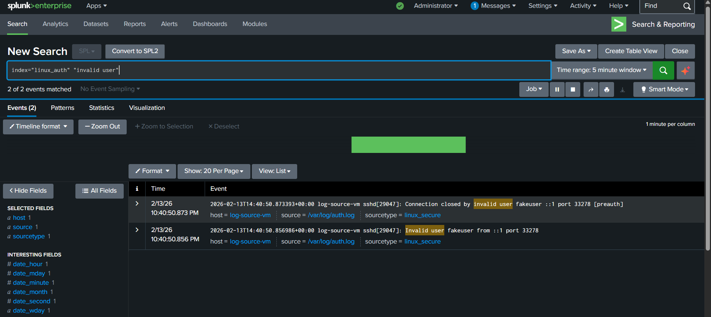

# Splunk Log Source Lab on GCP - Linux Forwarder to Splunk SIEM

## Project Overview

This project demonstrates a **basic Security Operations Center (SOC) lab** using Splunk SIEM.  
It simulates Linux log collection from a **Log Source VM** using the **Splunk Universal Forwarder**, forwarding authentication logs to a **Splunk Server VM** hosted on **Google Cloud Platform (GCP)**.

This project is designed for **SOC learning, threat simulation, and portfolio showcase**.

## Architecture
```
Log Source VM (Debian 12 Bookworm)
├─ Splunk Universal Forwarder (splunkfwd user)
├─ Monitors: /var/log/auth.log
└─ Forwards logs → Splunk Server VM (9997)

Splunk Server VM (Debian 12 Bookworm)
├─ Splunk Enterprise Free
├─ Receives logs (port 9997)
├─ Web UI (port 8000)
└─ Dashboards / Searches / Alerts
```


**Components:**

1. **Splunk Enterprise Server VM**
   - Receives logs from forwarders
   - Hosts Splunk Web UI on port `8000`
   - TCP input port `9997` for Universal Forwarders

2. **Log Source VM (Linux)**
   - Installs Universal Forwarder
   - Monitors `/var/log/auth.log`
   - Sends logs securely to Splunk Server

3. **Firewall Layers**
   - **GCP Firewall:** Controls ingress/egress traffic between VMs
   - **UFW OS Firewall:** Secures the VM at the operating system level

## Prerequisites

- Google Cloud account (Free Trial with $300 credit for 90 days)
- Two Ubuntu VMs:
  - **Splunk Server VM:** 2 vCPU, 8 GB RAM (for lab)
  - **Log Source VM:** 1 vCPU, 2 GB RAM
- Internet access to download Splunk packages

Splunk Enterprise Package


Splunk Universal Forwarder Package


## Splunk Server VM Setup

### 1. Update system and install dependencies

```bash
sudo apt update && sudo apt upgrade -y
sudo apt install wget curl ufw -y
```

### 3. Install Splunk Enterprise

```bash
# Sign up and download Splunk Enterprise Free trial package : https://www.splunk.com/en_us/download.html 
wget -O splunk-10.x.x.deb 'DOWNLOAD LINK'

# Install
sudo dpkg -i splunk-10.x.x.deb
```

```bash
sudo useradd -m splunk
sudo passwd splunk
```
### 5. Fix ownership
```bash
sudo chown -R splunk:splunk /opt/splunk
```
### 6. Start Splunk ad dedicated user
```bash
sudo su - splunk
/opt/splunk/bin/splunk start --accept-license
```
- When prompted, enter/create the Splunk administrator username and password, and store them securely.
- Note: Splunk Enterprise runs as `splunk` user. Do **NOT run as root** in production.

### 7. Access Splunk Web UI
Find VM external IP:
```bash
http://YOUR_VM_IP:8000
```
Login:
- Username : admin
- Password : set during install



### 8. Enable Auto Start
Exit `splunk` user first:
```bash
exit
sudo /opt/splunk/bin/splunk enable boot-start -user splunk
```

### 9. 🔥 UFW Configuration for Splunk Server VM (Firewall)
```bash
# SSH
sudo ufw allow from YOUR_IP to any port 22 proto tcp
# Splunk Web
sudo ufw allow from YOUR_IP to any port 8000 proto tcp
# Splunk Forwarders
sudo ufw allow from FORWARDER_IP to any port 9997 proto tcp
```
Don't forget the Default Deny rules.
```bash
sudo ufw default deny incoming
sudo ufw default allow outgoing
```
Enable firewall:
```bash
sudo ufw enable
sudo ufw status verbose
```

## Log Source VM Setup (Splunk Universal Forwarder)

### 1. SSH into Log Source VM and Update
```bash
ssh -i SSH-KEY.pub user@LOG_SOURCE_IP
sudo apt update && sudo apt upgrade -y
```

### 2. 📦 Download Splunk Universal Forwarder
```bash
wget -O splunkforwarder-10.2.0-d749cb17ea65-linux-amd64.deb "DOWNLOAD LINK"
```

### 3. Create Dedicated Forwarder User (CRITICAL)
**Never run forwarder as root
```bash
sudo useradd -m splunkfwd
sudo passwd splunkfwd
```
### 4. ⚙️ Install Splunk Universal Forwarder
```
sudo dpkg -i splunkforwarder.deb
```
### 5. 🔐 Fix Ownership (Important Step)
```bash
sudo chown -R splunkfwd:splunkfwd /opt/splunkforwarder
```

### 6. ▶️ Start Forwarder for the First Time
```bash
# Switch to Splunk Forwarder User.
sudo su - splunkfwd
/opt/splunkforwarder/bin/splunk start --accept-license
```
- Create another Administrator username and password and keep it securely.

### 7. 🔄 Stop Splunk Forwarder to Enable Boot Start (Run as Root)
-Exit as `splunkfwd` user:
```bash
exit
sudo -u splunkfwd /opt/splunkforwarder/bin/splunk stop
sudo /opt/splunkforwarder/bin/splunk enable boot-start -user splunkfwd
```

### 8. 🌐 Add Splunk Server (Indexer)
Switchback to user `splunkfwd`:
```bash
sudo su - splunkfwd
```
```bash
/opt/splunkforwarder/bin/splunk add forward-server SPLUNK_SERVER_IP:9997
```

### 9. 📥 Add Linux Auth Logs (SOC Use Case)
```bash
/opt/splunkforwarder/bin/splunk add monitor /var/log/auth.log -index linux_auth -sourcetype linux_secure
```

### 10. 🔁 Restart Splunk Forwarder
```bash
/opt/splunkforwarder/bin/splunk add forward-server SPLUNK_SERVER_IP:9997
```

### 11. ✅ Verify Splunk Forwarder Status
```bash
/opt/splunkforwarder/bin/splunk list forward-server
```
Expected output:
```bash
Active forwards:
  SPLUNK_SERVER_IP:9997
```
### 12. UFW Firewall Configuration for Log Source VM
Allow your local machine to SSH the Log Source VM
```bash
# SSH
sudo ufw allow from YOUR_IP to any port 22 proto tcp
# Default deny
sudo ufw default deny incoming
sudo ufw default allow outgoing
# Enable  the firewall
sudo ufw enable
sudo ufw status verbose
```


### 13. Enable Splunk Server to Listen on port 9997
Run on Splunk Server VM
```bash
sudo -u splunk /opt/splunk/bin/splunk enable listen 9997
```

## Generate Test Logs
**On Log Source VM:**
```bash
ssh fakeuser@localhost
```
**Check in Splunk**
```
index=linux_auth "Invalid user"
```

